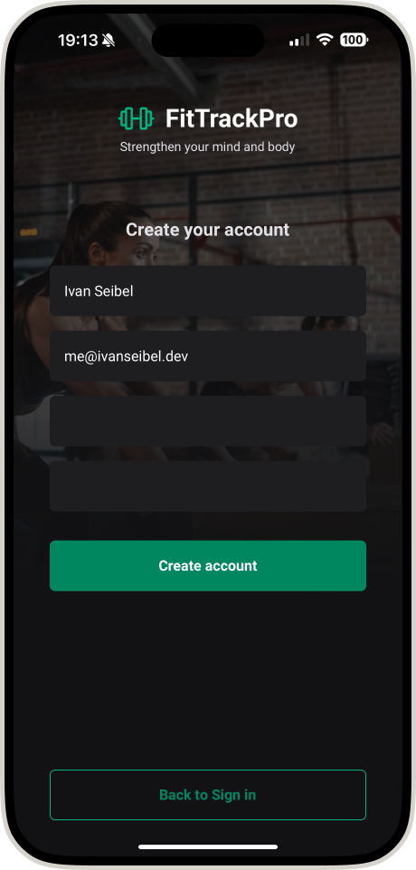
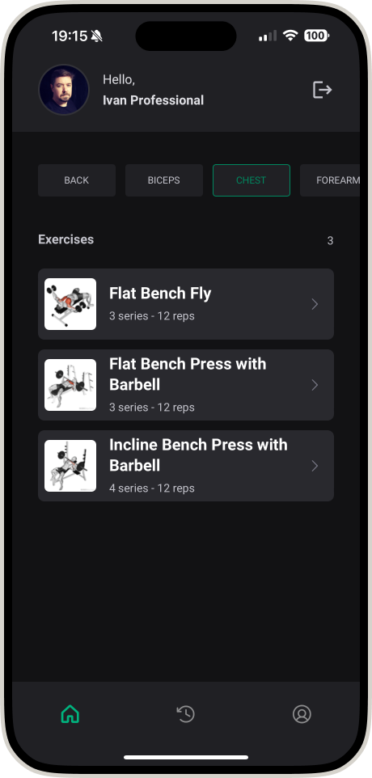
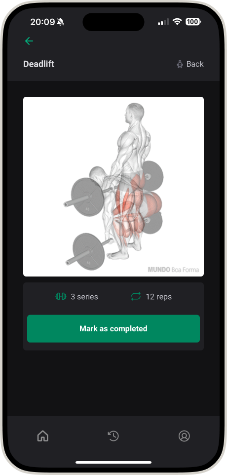
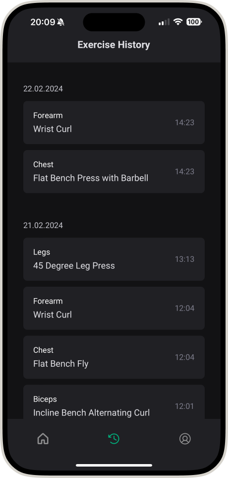
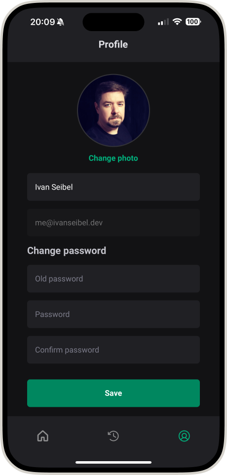

# FitTrackPro

## About The Project

FitTrackPro is a fitness tracking application that allows users to efficiently manage and track their workout routines. With a focus on convenience and user experience, FitTrackPro offers a sleek interface to organize exercises by muscle group, log workout history, and manage personal user profiles.

The application provides clear visuals of exercises, sets, and repetitions, and includes a feature to mark exercises as completed. It is the perfect companion for fitness enthusiasts looking to streamline their workout tracking process.

## Screenshots

Here are some glimpses of the FitTrackPro in action:

| Sign In | Sign Up | Home |
|------|----------|---------|
|  |  |  |

| Exercise | History | Profile |
|---------|----------------|-------------|
|  |  |  |

These screenshots are taken from various features of the app to provide a preview of the user interface and functionality.


## Key Dependencies

- `@react-navigation/native` and `@react-navigation/bottom-tabs`: These libraries facilitate navigation within the app, providing a way to transition between screens and manage the app's navigation stack.
- `axios`: A promise-based HTTP client for making asynchronous requests to remote servers, ideal for handling REST API calls.
- `expo`: An open-source platform for making universal native apps for Android, iOS, and the web with JavaScript and React.
- `react-native-svg` and `react-native-svg-transformer`: These allow for SVG support within React Native, enabling complex graphics and icons to be rendered in the app.
- `native-base`: A complete UI toolkit for React Native that provides a set of accessible, reusable, and composable components to bootstrap the app's design.
- `react-hook-form`: This library simplifies form management and validation, making it easier to collect, validate, and submit user input.
- `yup`: A JavaScript schema builder for value parsing and validation which integrates seamlessly with react-hook-form.
- `@react-native-async-storage/async-storage`: An asynchronous, unencrypted, persistent, key-value storage system for React Native which is used to store user preferences or session data.

## Installation

To get a local copy up and running follow these simple steps:

1. Clone the repository:
   
   ```sh
   git clone git@github.com:ivanseibel/fittrackpro-react-native-experiments.git
    ```

2. Install the required packages (assuming you are using npm as your package manager):

    ```sh
    npm install
    ```

## Usage

To use FitTrackPro, simply:

1. Open the application on your device.
3. Sign in or create an account to access the app's features.
4. Select a muscle group to view associated exercises.
5. Track your progress by marking exercises as complete after performing them.
6. View your exercise history to monitor your workouts over time.
7. Access your profile to update your personal information.

## Features

- Exercise categorization by muscle group.
- Visual guides for each exercise.
- Workout completion tracking.
- Personal workout history.
- User profile management.

## Contributing

Contributions are what make the open-source community such an amazing place to learn, inspire, and create. Any contributions you make are greatly appreciated.

If you have a suggestion that would make this better, please fork the repository and create a pull request. You can also simply open an issue with the tag "enhancement". Don't forget to give the project a star! Thanks again!

- Fork the Project
- Create your Feature Branch (git checkout -b feature/AmazingFeature)
- Commit your Changes (git commit -m 'Add some AmazingFeature')
- Push to the Branch (git push origin feature/AmazingFeature)
- Open a Pull Request

## License

Distributed under the MIT License. See LICENSE for more information.